  

### 感谢辣个神一样的男银: [**<u>X_Jun</u>**](https://home.cnblogs.com/u/X-Jun/)

#### 以及他的[**<u>项目</u>**](https://github.com/MKXJun/DX11-Without-DirectX-SDK)和[**<u>博客</u>**](https://www.cnblogs.com/X-Jun/p/9028764.html)

## 说在前面

感谢所有帮过我的人,不论是作为朋友还是老师,感谢你们给予我行走在这条道路上的勇气,感谢你们耐心的指导,谢谢.

#### 开始吧

入门第一作,因为录制GIF导致帧数不到正常的1/3(甚至不到1/4)

入门第二作,车车做好了(虽然早就可以做了...)

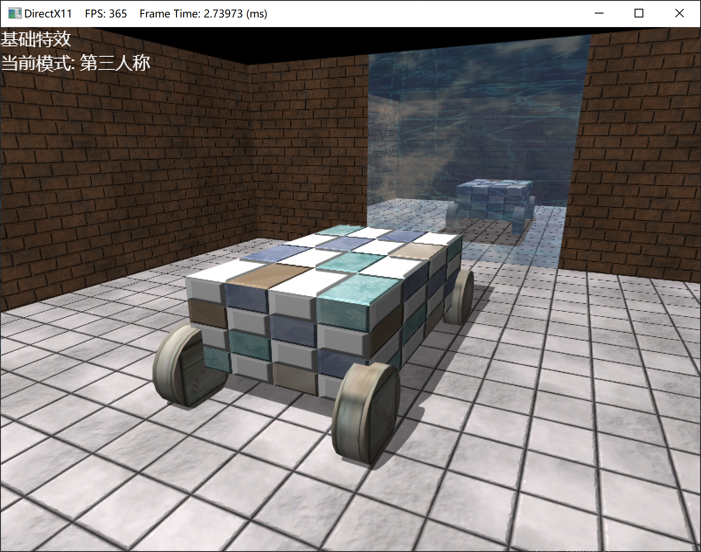

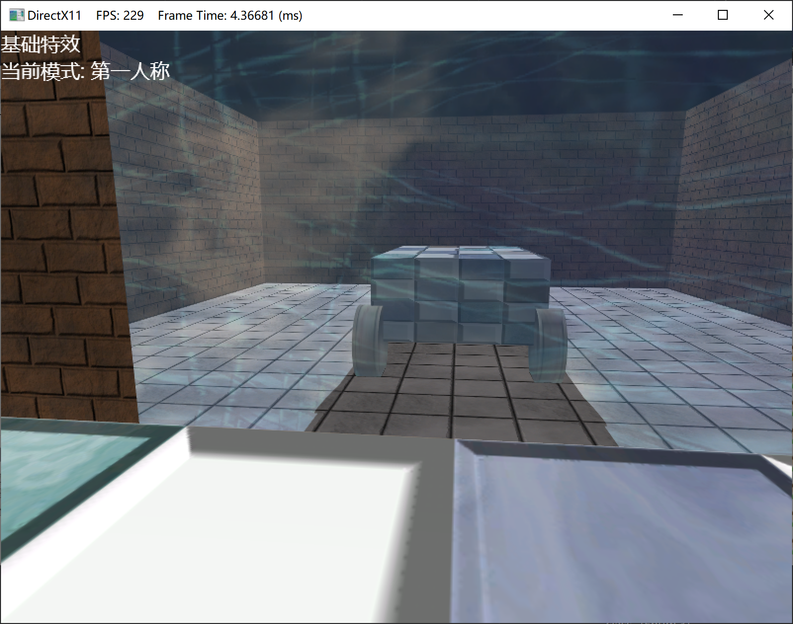

命名风格应该基本确定了(主要是决定了struct成员命名为lowerCamelCase,而class成员命名为m_lowerCamelCase,**struct的成员不再添加m_前缀**.还有一些大小写的习惯.)

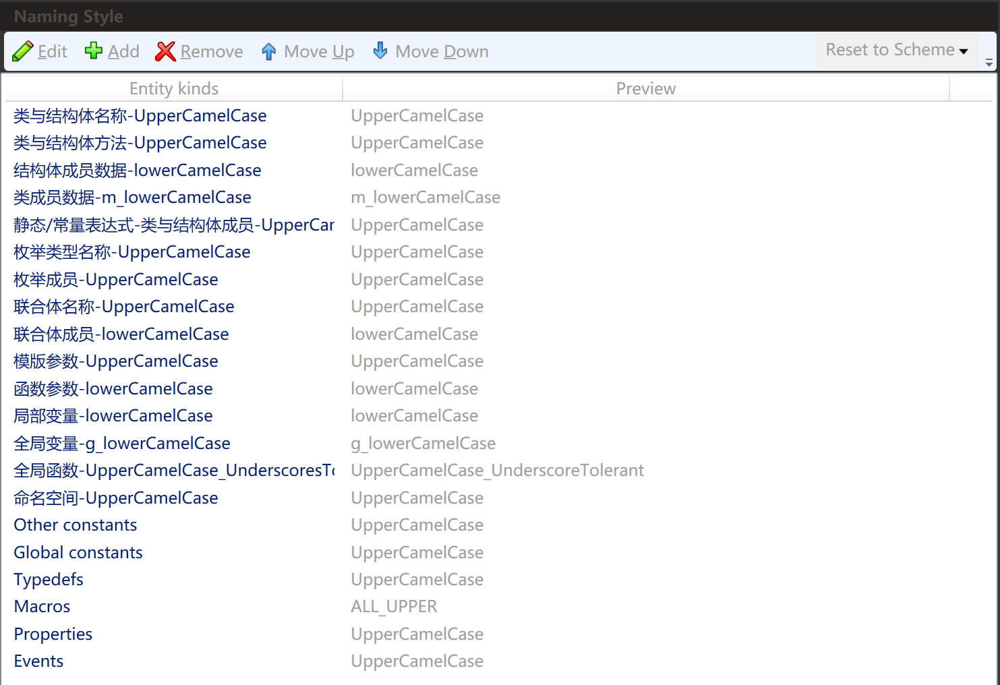

入门第三作,开炮!!!

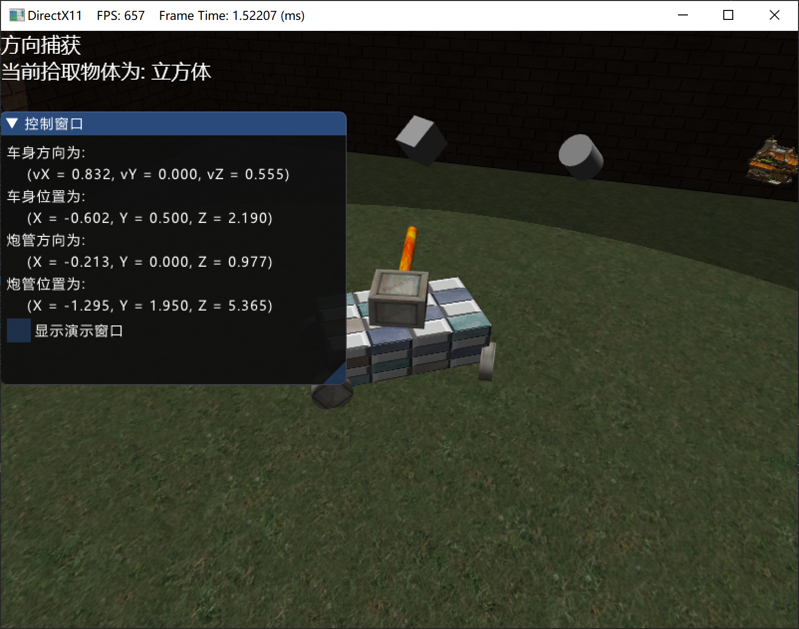

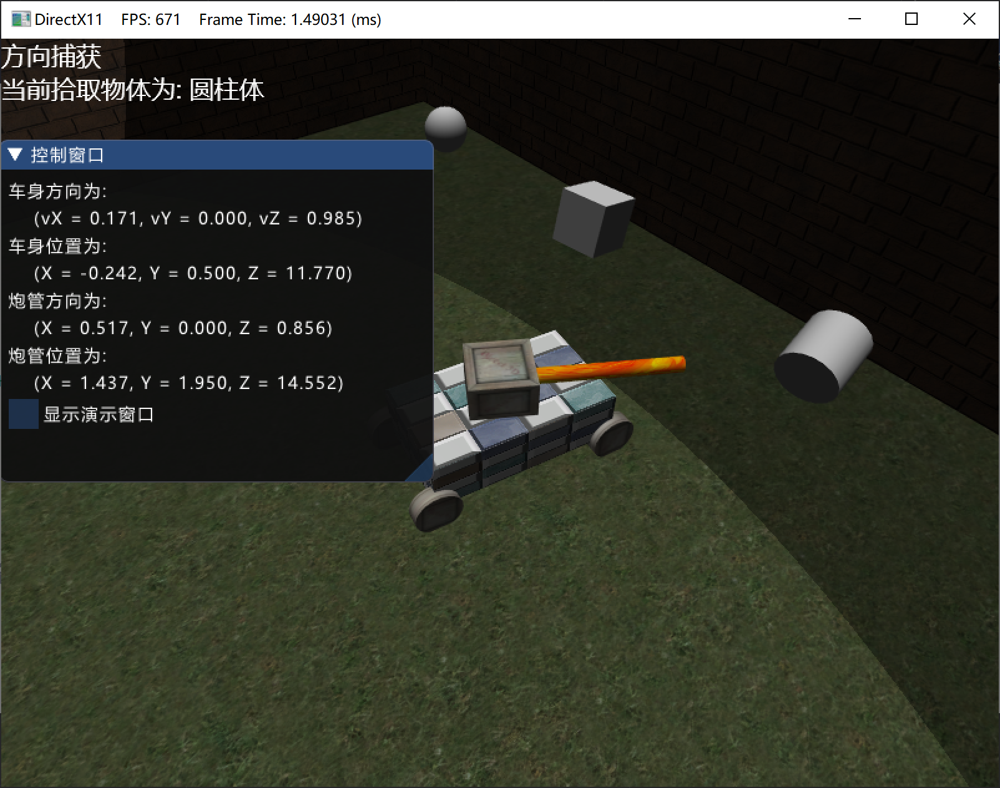

入门第四作,静态天空盒

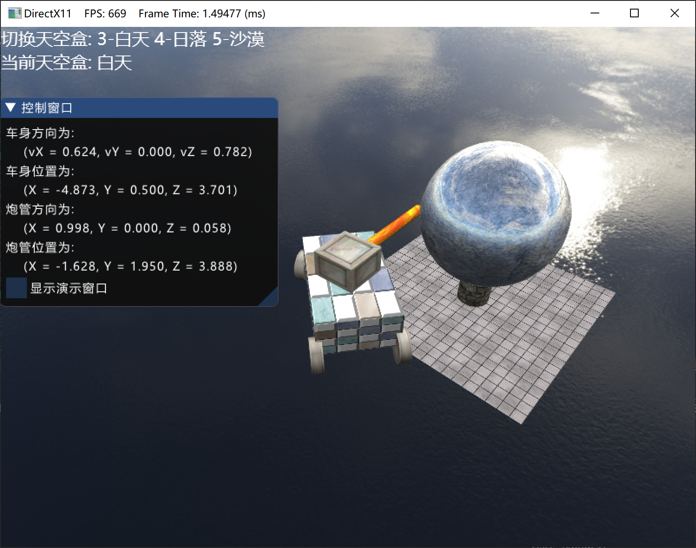

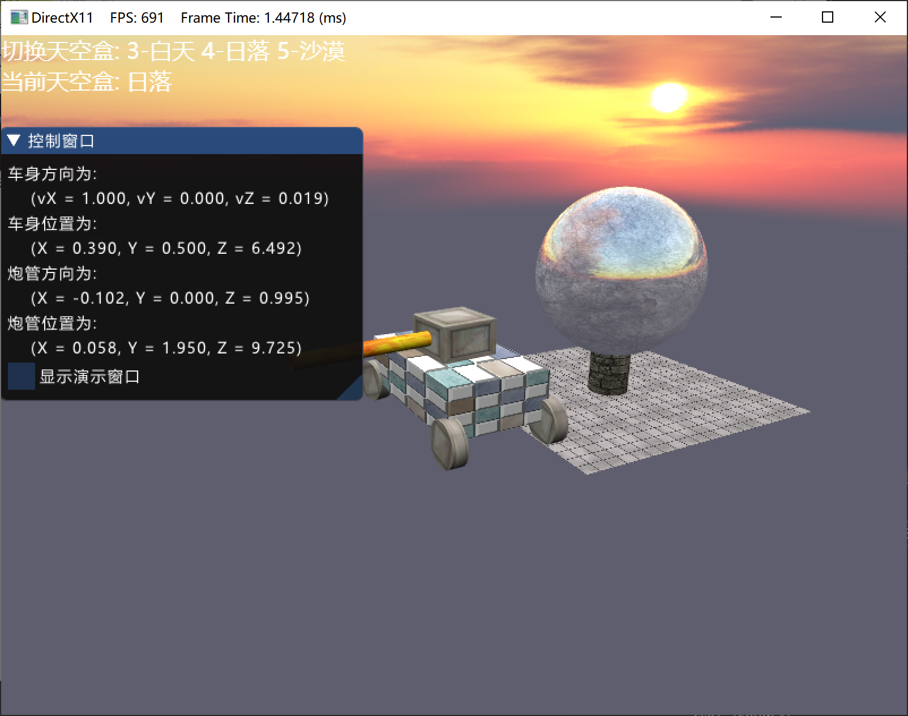

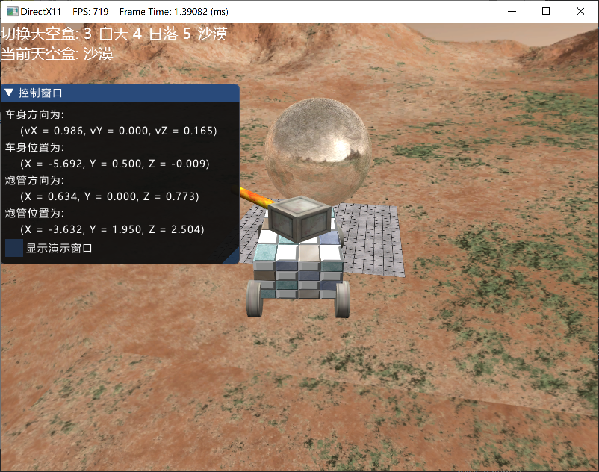

入门第五作,新的车车

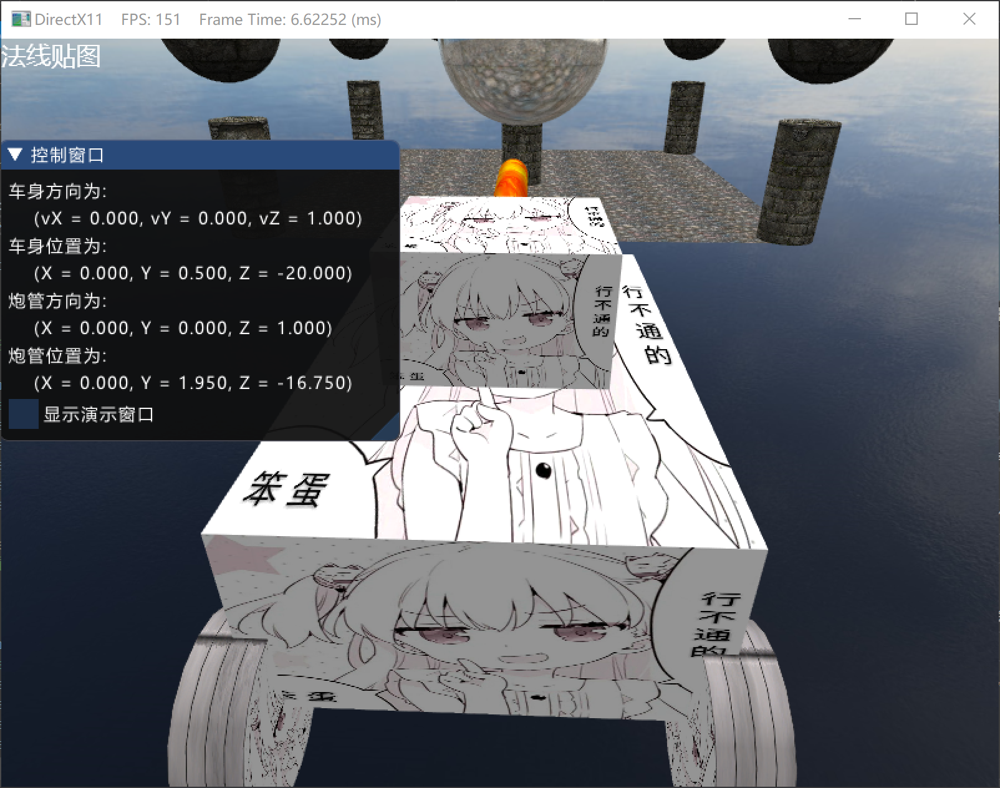

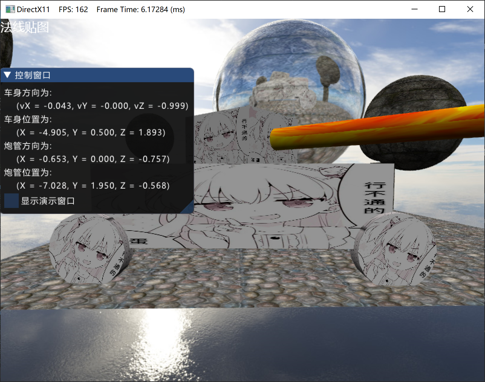

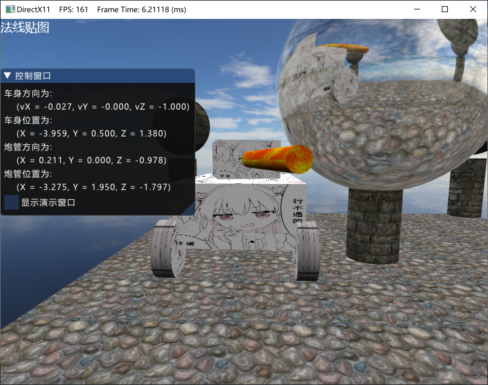

